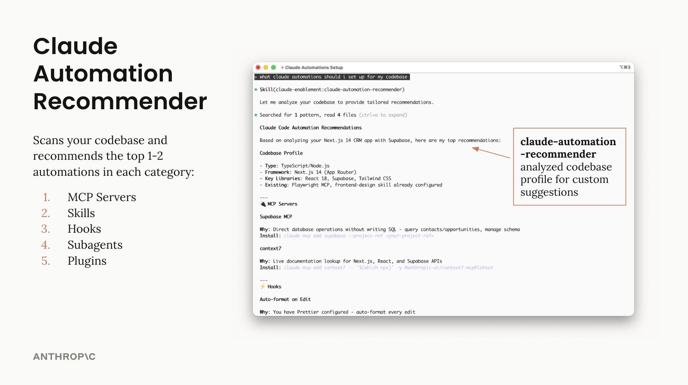

# Claude Code Setup Plugin

Analyze codebases and recommend tailored Claude Code automations - hooks, skills, MCP servers, and more.

## What It Does

Claude uses this skill to scan your codebase and recommend the top 1-2 automations in each category:

- **MCP Servers** - External integrations (context7 for docs, Playwright for frontend)
- **Skills** - Packaged expertise (Plan agent, frontend-design)
- **Hooks** - Automatic actions (auto-format, auto-lint, block sensitive files)
- **Subagents** - Specialized reviewers (security, performance, accessibility)
- **Slash Commands** - Quick workflows (/test, /pr-review, /explain)

This skill is **read-only** - it analyzes but doesn't modify files.

## Usage

```
"recommend automations for this project"
"help me set up Claude Code"
"what hooks should I use?"
```



## Author

Isabella He (isabella@anthropic.com)
